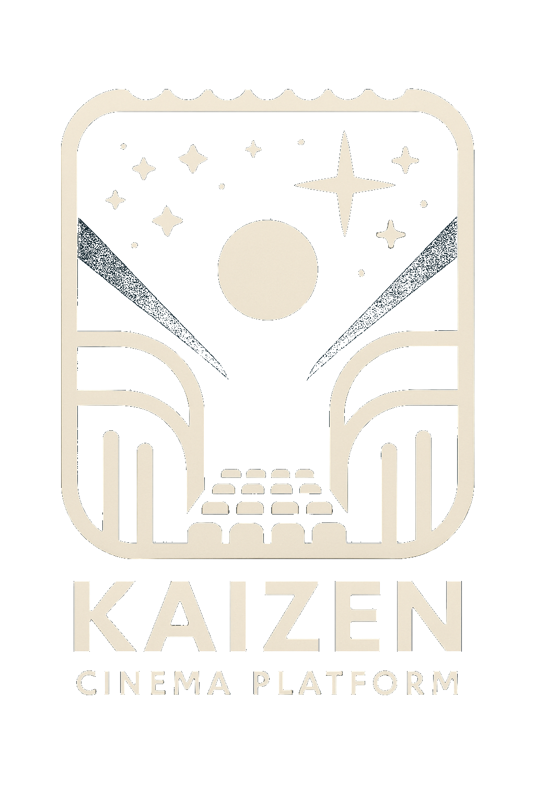

# Kaizen Cinema

<div align="center">
<table>
<tr>
<td width="70%">
<h1>Kaizen Cinema</h1>
<h3>Sistema de gestión integral para cines</h3>
<p>Una plataforma moderna para la administración completa de cines, gestión de películas y experiencia de usuario mejorada</p>

[](https://php.net)
[](https://laravel.com)
[](https://svelte.dev)
[](https://postgresql.org)
[](LICENSE)
[](https://github.com/mgrl39/kaizen)

</td>
<td width="30%">

</td>
</tr>
</table>
</div>

## 📋 Índice

- [🚀 Inicio Rápido](#-inicio-rápido)
- [✨ Características](#-características)
- [🏗️ Arquitectura](#-arquitectura)
- [🧰 Tecnologías](#-tecnologías)
- [📊 Módulos del Sistema](#-módulos-del-sistema)
- [🔧 Desarrollo](#-desarrollo)
- [🤝 Patrocinadores](#-patrocinadores)

## 🚀 Inicio Rápido

### Instalación con Podman

```bash
# Clonar el repositorio
git clone https://github.com/mgrl39/kaizen.git
cd kaizen

# Iniciar con Podman
podman-compose up -d
```

### Instalación Manual

```bash
# Clonar el repositorio
git clone https://github.com/mgrl39/kaizen.git
cd kaizen

# Backend
cd srcs/back
composer install
cp .env.example .env
php artisan key:generate
php artisan migrate --seed
php artisan serve

# Frontend
cd srcs/front
npm install
npm run dev
```

## ✨ Características

<table>
<tr>
<td width="33%">
<h3>🎬 Gestión de Películas</h3>
<ul>
<li>Catálogo completo de películas</li>
<li>Información detallada y metadata</li>
<li>Clasificación por géneros</li>
<li>Galería de imágenes</li>
<li>Integración con APIs externas</li>
</ul>
</td>
<td width="33%">
<h3>🏢 Administración de Cines</h3>
<ul>
<li>Gestión de múltiples complejos</li>
<li>Configuración de salas</li>
<li>Tipos de pantallas (IMAX, 3D, etc.)</li>
<li>Mapas de asientos personalizables</li>
<li>Estadísticas de ocupación</li>
</ul>
</td>
<td width="33%">
<h3>🎟️ Sistema de Reservas</h3>
<ul>
<li>Selección visual de asientos</li>
<li>Procesamiento de pagos</li>
<li>Generación de tickets digitales</li>
<li>Historial de compras</li>
<li>Notificaciones automáticas</li>
</ul>
</td>
</tr>
</table>

## 🏗️ Arquitectura

Kaizen Cinema implementa una arquitectura moderna de microservicios:

- **Backend API RESTful**: Desarrollado con Laravel 10, proporciona endpoints seguros y documentados
- **Frontend SPA**: Interfaz de usuario reactiva construida con Svelte 4
- **Base de datos**: PostgreSQL optimizado para consultas complejas y alta concurrencia
- **Autenticación**: Sistema JWT con roles y permisos granulares
- **Contenedores**: Implementación con Podman para entornos aislados y seguros

## 🧰 Tecnologías

<div align="center">

| Backend         | Frontend    | DevOps         | Herramientas |
| --------------- | ----------- | -------------- | ------------ |
| PHP 8.1+        | Svelte 4    | Podman         | Git          |
| Laravel 10      | SvelteKit   | GitHub Actions | VS Code      |
| PostgreSQL      | TailwindCSS | CI/CD          | Postman      |
| JWT Auth        | TypeScript  | Nginx          | PHPUnit      |
| Laravel Sanctum | Vite        | Focalboard     | Swagger      |

</div>

## 📊 Módulos del Sistema

- **Panel de Administración**: Gestión completa del sistema para operadores de cine
- **Catálogo de Películas**: Visualización y filtrado avanzado del catálogo
- **Programación de Sesiones**: Calendario visual para programar proyecciones
- **Sistema de Reservas**: Proceso intuitivo de selección y compra de entradas
- **Gestión de Usuarios**: Perfiles, preferencias y historial de compras
- **Reportes y Estadísticas**: Análisis de ventas, ocupación y rendimiento
- **API Pública**: Documentada con Swagger para integraciones externas
- **Gestión de Tareas**: Integración con Focalboard para seguimiento de proyectos

## 🔧 Desarrollo

### Requisitos

- PHP 8.1+
- Composer 2.0+
- Node.js 16+
- PostgreSQL 15+
- Podman

### Comandos Útiles

```bash
# Backend (desde srcs/back)
php artisan serve                # Iniciar servidor de desarrollo
php artisan test                 # Ejecutar tests
php artisan migrate:fresh --seed # Reiniciar base de datos con datos de prueba
php artisan scribe:generate      # Generar documentación de API

# Frontend (desde srcs/front)
npm run dev      # Servidor de desarrollo
npm run build    # Compilar para producción
npm run test     # Ejecutar tests
npm run lint     # Verificar estilo de código

# Podman
./srcs/conf/postgres/pg-podman.sh start    # Iniciar contenedor PostgreSQL
./srcs/conf/postgres/pg-podman.sh dump     # Generar dump de la base de datos
```

### Estructura del Proyecto

```
kaizen/
├── srcs/
│   ├── back/           # Backend Laravel
│   │   ├── app/        # Lógica principal
│   │   ├── database/   # Migraciones y seeders
│   │   └── routes/     # Definición de endpoints API
│   │
│   └── front/          # Frontend Svelte
│       ├── src/        # Código fuente
│       ├── static/     # Archivos estáticos
│       └── tests/      # Tests de frontend
│
├── docker/             # Configuración de Podman
└── .github/            # Workflows de GitHub Actions
```

## 🤝 Patrocinadores

<div align="center">
<a href="https://github.com/sponsors/mgrl39">
  
</a>
</div>

---

<div align="center">
<p>Desarrollado con ❤️ por mgrl39</p>
<p><small>Inspirado en Gadget - Sistema de webscraping y análisis de datos de cines</small></p>
</div>
