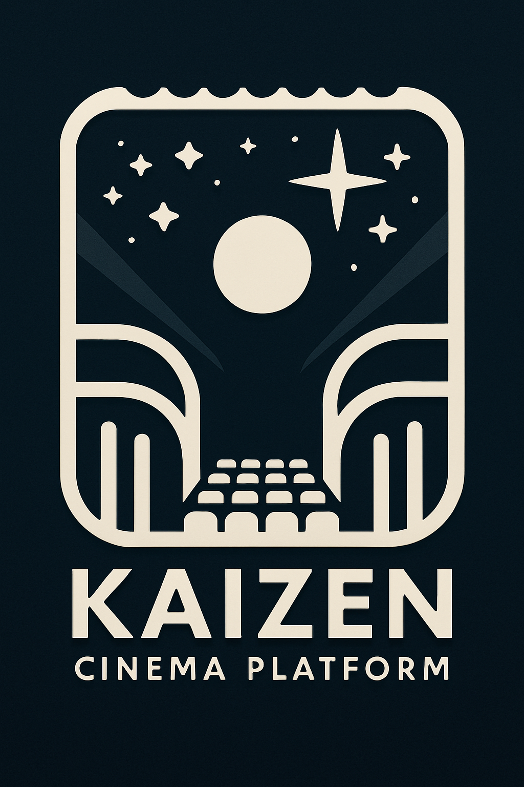

# rsv_sys

<p align="center">
  
</p>

> Una aplicación web moderna para la gestión integral de cines, salas, películas y reservas, con un completo sistema de administración y experiencia de usuario mejorada.

<p align="center">
  
  
  
  
  
</p>

## ✨ Características Principales

- 🏢 **Gestión de cines y salas** - Administra múltiples cines y controla sus salas
- 🎞️ **Catálogo de películas** - Mantén actualizado tu catálogo con toda la información relevante
- 🎭 **Funciones y horarios** - Programa proyecciones con fechas y horas personalizadas
- 🎟️ **Sistema de reservas** - Gestión completa del proceso de reserva de asientos
- 👥 **Gestión de usuarios** - Diferentes roles y permisos para administradores y clientes
- 📊 **Panel de administración** - Interfaz intuitiva para gestionar todos los aspectos del sistema
- 📱 **Diseño responsive** - Experiencia optimizada en cualquier dispositivo

## 🔧 Stack Tecnológico

<p align="center">
  &nbsp;&nbsp;&nbsp;
  &nbsp;&nbsp;&nbsp;
  &nbsp;&nbsp;&nbsp;
  
</p>

<p align="center">
  <b>Backend:</b> PHP 8.1+ | Laravel 10.x | <b>Base de datos:</b> MySQL | <b>Frontend:</b> Bootstrap 5, Vue.js 3
</p>

<p align="center">
  <b>Herramientas adicionales:</b> JWT para autenticación | Redis para caché | Livewire para componentes interactivos
</p>

## 🚀 Instalación Rápida

### Requisitos previos
- PHP 8.1 o superior
- Composer
- MySQL 5.7 o superior
- Node.js y npm

### Pasos para instalación

1. **Clonar el repositorio:**
   ```bash
   git clone https://github.com/mgrl39/rsv_sys.git
   cd rsv_sys
   ```

2. **Instalar dependencias PHP:**
   ```bash
   composer install
   ```

3. **Instalar dependencias JavaScript:**
   ```bash
   npm install
   npm run dev
   ```

4. **Configurar el entorno:**
   ```bash
   cp .env.example .env
   php artisan key:generate
   ```

5. **Configurar la base de datos en el archivo .env:**
   ```
   DB_CONNECTION=mysql
   DB_HOST=127.0.0.1
   DB_PORT=3306
   DB_DATABASE=cinedb
   DB_USERNAME=root
   DB_PASSWORD=
   ```

6. **Ejecutar migraciones y seeders:**
   ```bash
   php artisan migrate --seed
   ```

7. **Iniciar el servidor de desarrollo:**
   ```bash
   php artisan serve
   ```
   La aplicación estará disponible en http://localhost:8000

## 🏗️ Estructura del Proyecto
