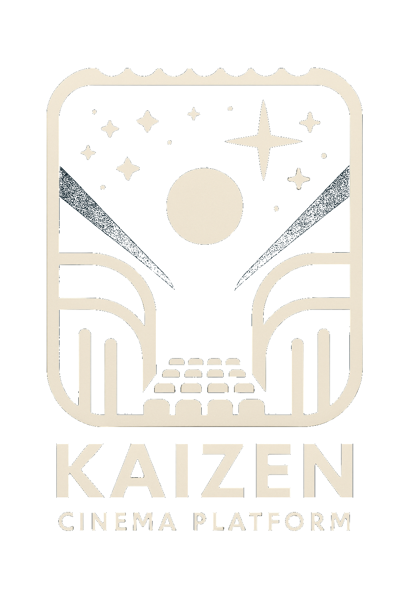

<div align="center" style="text-align: center; width: 100%">

<h1>Kaizen Cinema<br/><sub>Sistema de gestión integral para cines</sub></h1>

▶️ <a href="#inicio-rapido">Inicio Rápido</a> | <a href="#vision-general">Visión General</a> | <a href="#funcionalidades">Funcionalidades</a> | <a href="#desarrollo">Desarrollo</a>

<a href="https://php.net"></a>
<a href="https://laravel.com"></a>
<a href="https://svelte.dev"></a>
<a href="https://postgresql.org"></a>
<a href="https://podman.io"></a>
<a href="LICENSE"></a>
<a href="#status"></a>

</div>
<hr/>

**Kaizen Cinema es un sistema completo para la gestión de cines, con aplicación web integrada.**

Esta aplicación basada en Laravel con frontend en Svelte proporciona todas las herramientas necesarias para la gestión de películas, programación de sesiones y reserva de asientos.

> ➡️ Comienza rápidamente usando nuestra [Guía de Inicio Rápido](#inicio-rapido) ⭐️

<hr/>

## Visión General

Kaizen Cinema ofrece una solución integral para la gestión de cines:

- Gestión de películas
- Configuración de cines y salas de proyección
- Programación de sesiones
- Gestión de reservas
- Autenticación de usuarios

El sistema incluye una interfaz web completa para administradores y usuarios finales.

## Inicio Rápido

```bash
git clone https://github.com/mgrl39/kaizen.git && cd kaizen # Clonar repositorio
cd srcs/conf/postgres && ./pg-podman.sh start # Iniciar contenedor PostgreSQL
cd srcs/conf/focalboard && ./fb-podman.sh start # Iniciar Focalboard para gestión de proyecto
make install # Usar el Makefile para configuración fácil
make back # Iniciar el servidor
make db # (Opcional) Ejecutar migraciones de base de datos
```

> **Nota**  
> La base de datos PostgreSQL está automáticamente configurada en un contenedor Podman. Tu archivo `.env` ya debería estar configurado para conectarse a ella.

## Funcionalidades

El sistema proporciona las siguientes funcionalidades principales:

- **Gestión de películas**: Catálogo, información, clasificaciones
- **Cines y salas**: Configuración, capacidad, tipo de pantalla
- **Sesiones**: Programación, precios, disponibilidad
- **Reservas**: Venta de entradas, selección de asientos
- **Usuarios**: Registro, perfiles, historial

## Desarrollo

### Requisitos

- PHP 8.1+
- Composer
- Podman (para PostgreSQL y Focalboard en contenedores)

### Gestión de Contenedores

Los servicios se ejecutan en contenedores Podman para facilitar el desarrollo:

```bash
# PostgreSQL
cd srcs/conf/postgres && ./pg-podman.sh start # Iniciar contenedor de base de datos
cd srcs/conf/postgres && ./pg-podman.sh logs # Ver logs de la base de datos
cd srcs/conf/postgres && ./pg-podman.sh shell # Acceder al shell de PostgreSQL
cd srcs/conf/postgres && ./pg-podman.sh reset # Resetear base de datos (precaución: elimina todos los datos)

# Focalboard (gestión de proyecto)
cd srcs/conf/focalboard && ./fb-podman.sh start # Iniciar Focalboard
cd srcs/conf/focalboard && ./fb-podman.sh info # Ver información de acceso
```

### Comandos Útiles

Usa nuestro Makefile simplificado para tareas comunes de desarrollo:

```bash
make install # Instalar dependencias
make back # Ejecutar el servidor con acceso externo
make fresh # Resetear la base de datos
make clear # Limpiar todas las cachés
```

## Colaboradores

<div align="center">

<a href="https://github.com/mgrl39/kaizen/graphs/contributors">
  
</a>

¡Kaizen Cinema es mejorado y mantenido por personas como tú! 🚀

</div>
