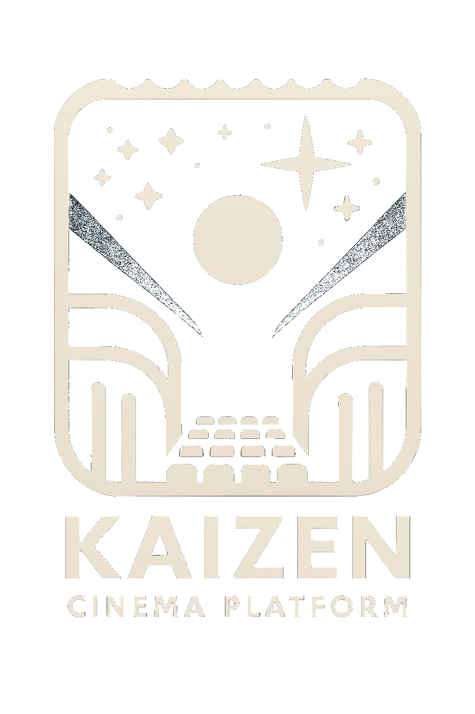

<table border="0" width="100%" align="center" style="border: none;">
  <tr>
    <td width="120" align="center" valign="middle">
      
    </td>
    <td align="left" valign="middle" style="padding-left: 20px;">
      <h1 style="margin-bottom: 0; font-size: 2.7em; font-weight: bold; color: #222;">Kaizen Cinema</h1>
      <div style="font-size: 1.15em; color: #555; margin-top: -10px;">
        <strong>Sistema de gestión para cines</strong>
      </div>
    </td>
  </tr>
</table>

<p align="left" style="margin-top: 0;">
  <a href="#inicio-rapido"></a>
  <a href="#vision-general"></a>
  <a href="#funcionalidades"></a>
  <a href="#desarrollo"></a>
</p>

<p align="left">
  <a href="https://php.net"></a>
  <a href="https://laravel.com"></a>
  <a href="https://svelte.dev"></a>
  <a href="https://postgresql.org"></a>
  <a href="LICENSE"></a>
  <a href="#status"></a>
</p>

---

**Kaizen Cinema** es un sistema integral de gestión para cines, con una aplicación web moderna y responsive.

Desarrollado en Laravel (backend) y Svelte (frontend), te permite administrar películas, funciones y reservas con una interfaz intuitiva y profesional.

---

### ¿Por qué Kaizen Cinema?

- 🎬 **Gestión de películas**: Catálogo, fichas técnicas y clasificaciones.
- 🏢 **Cines y salas**: Configuración flexible, capacidades y tipos de pantalla.
- 🕓 **Sesiones**: Programación dinámica, precios y disponibilidad.
- 🎟️ **Reservas**: Venta de entradas y selección de asientos en tiempo real.
- 👥 **Usuarios**: Registro, perfiles personalizados e historial.

---

## 🚀 Inicio Rápido

```bash
git clone https://github.com/mgrl39/kaizen.git && cd kaizen
cd srcs/back && composer install      # Backend dependencies
cd ../front && npm install           # Frontend dependencies
cd ../back && php artisan serve      # API backend
cd ../front && npm run dev           # Frontend dev server
```

---

## 🔎 Funcionalidades Principales

- **Gestión de películas**: Catálogo, información, clasificaciones.
- **Cines y salas**: Configuración, capacidad, tipo de pantalla.
- **Sesiones**: Programación, precios, disponibilidad.
- **Reservas**: Venta de entradas, selección de asientos.
- **Usuarios**: Registro, perfiles, historial.

---

## 🛠️ Desarrollo

**Requisitos:**

- PHP 8.1+
- Composer
- Node.js & npm

**Comandos útiles:**

```bash
# Backend (srcs/back)
php artisan serve      # Servidor API
php artisan migrate    # Migraciones
php artisan db:seed    # Seeders

# Frontend (srcs/front)
npm run dev            # Dev server
npm run build          # Build producción
```

---

## 👥 Colaboradores

<p align="center">
  <a href="https://github.com/mgrl39/kaizen/graphs/contributors">
    
  </a>
</p>